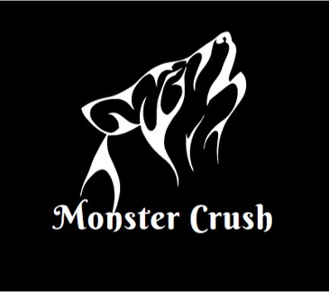

# Monster Crush

---
## 一、遊戲講解
MonsterCrush是一款仿Candy Crush的遊戲，本專案利用 Java 程式語言之 GUI 實作之。
---
## 二、檔案說明
|物件檔案 | 說明|
|---|---|
|MonsterStart.java |主程式啟動檔案 |
|MonsterStartPanel.java |遊戲起始封面介面 |
|MonsterJFrame.java |主遊戲介面 |
|MonsterBorder.java |遊戲介面之邊界物件 |
|MonsterItem.java |遊戲介面之道具介面 |
|MonsterPanel.java |遊戲介面之怪物介面 |
|MonsterUserpanel.java |遊戲介面之使用者資訊欄 |
|Monsterkill.java |運算邏輯 |
|MonsterUserpanel.java |使用者資料 |
---
## 三、安裝說明
1. 確認電腦有無下載 Java。
2. Window 搜尋 cmd 進入命令提示字元。
3. 進入 MonsterCrush 位置 ( xxx為路徑)。
    > cd xxx/xxx/xxx/
4. 輸入以下指令進行程式安裝編譯。
    > javac MonsterStart
5. 輸入 java MonsterStart 進行遊戲。
    > java MonsterStart
---
## 四、遊戲規則
* 基本玩法
    1. 上下左右移動任一怪物，移動一次扣除一個步數。
    2. 移動後若能產生3以上的相同怪物連線，則消除怪物獲得分數。
    3. 當步數為 0 時遊戲結束。
* 道具規則
    1. 消除L或T字型怪物獲得炸彈，可消除指定位置九宮格所有怪物。
    2. 消除4連怪物可獲得對應方向的消除道具，消除對應方向所有怪物。
    3. 消除5連怪物可獲得埋葬，可消除某種指定的全部怪物。

